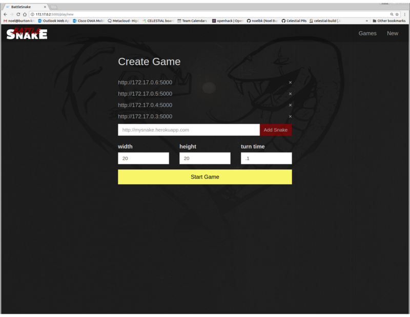

# Battlesnake - Duelling Snake AIs

[Battlesnake](http://www.battlesnake.io/) is a great AI competition
started by [SendWithUs](http://sendwithus.com).  This
is [my snake](app/snake.py), wrapped up in [Docker](http//docker.com)
containers so you can try it yourself locally.  Here's how:

Running a local arena
---------------------

0. install [Docker](http//docker.com).

1. build a docker image for the battlesnake snake

    ```
	docker build -t battlesnake-python github.com/noelbk/battlesnake-heroku
    ```

2. build a docker image for the battlesnake server

    ```
    docker build -t battlesnake-server github.com/noelbk/battlesnake-legacy
    ```

3. start the server

    ```
    docker run -d battlesnake-server
    ```

4. Connect to the server

    ```
    docker inspect --format 'http://{{ .NetworkSettings.IPAddress }}:5000/play/new' $(docker ps -f ancestor=battlesnake-server --format={{.ID}})
    ```

5. start some snakes

    ```
    for i in $(seq 1 4); do docker run -d battlesnake-python; done
    ```

6. print the snake urls and insert them into the game

    ```
    docker inspect --format 'http://{{ .NetworkSettings.IPAddress }}:5000' $(docker ps -f ancestor=battlesnake-python --format={{.ID}})
    ```

Start Game.  (Set the turn time to 0.05 for a faster game)



Start Automated.


To the Death!


Have fun playing, and if you're in Victoria, BC, hope to see you in 2017.

--
Noel
